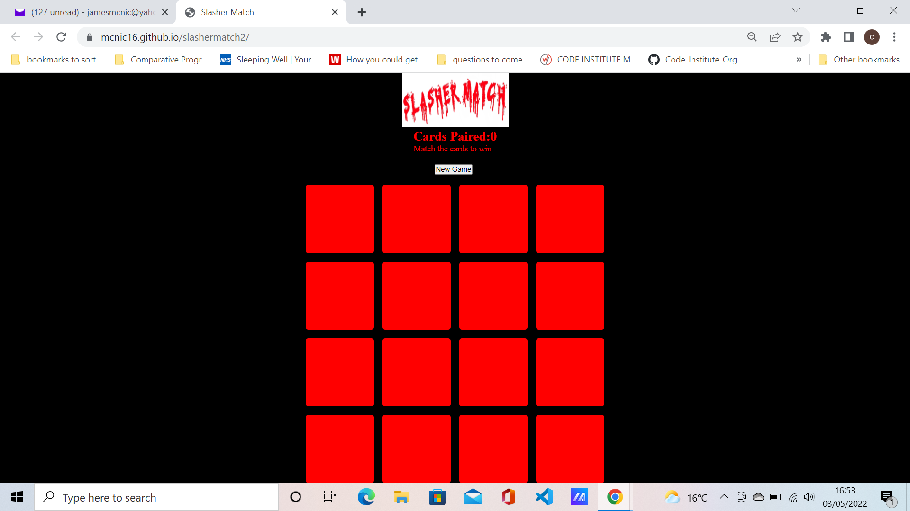
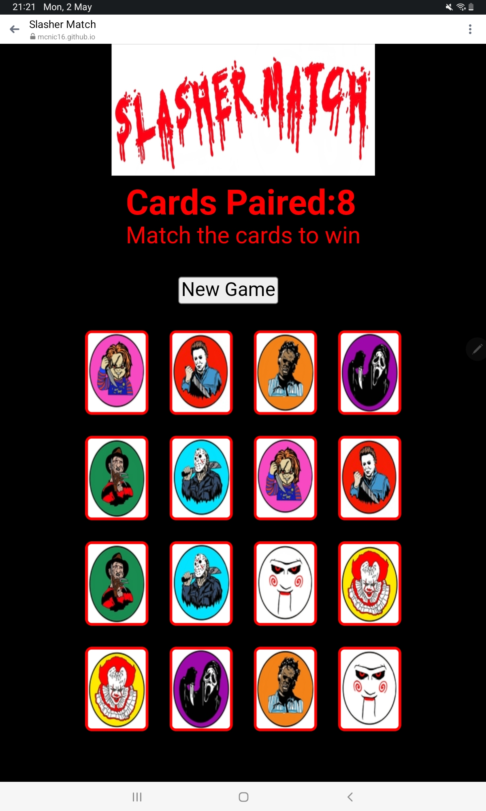
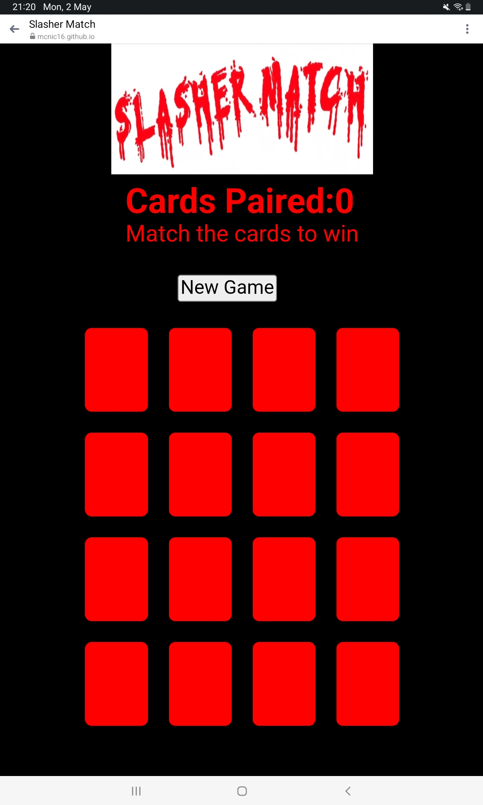

<h1 align="center">Slasher Match</h1>

[View live project](https://mcnic16.github.io/slashermatch2)

Project Goals
The name of this game is called SlasherMatch.
The goal of this memory game is to match two cards that have horror characters on them.

Player Goals

A fun game to play
Match all the characters to win the game

<h2 align="left"></h2> 

## User Experience

1. Fun game to play
2. To test your memory skills
3. Easy to play

## Design

- The main colour scheme of the game is red and white.

## Technologies Used

Languages:
- HTML 5 and CSS and Javascript

 ## Frameworks, Libraries & Programs Used

 Git was used for the Gitpod terminal to commit to Git and Push to GitHub.
 
 - [GitHub:](https://github.com/)
 GitHub is used to store the projects code after being pushed from Git

 ## Wireframes

 