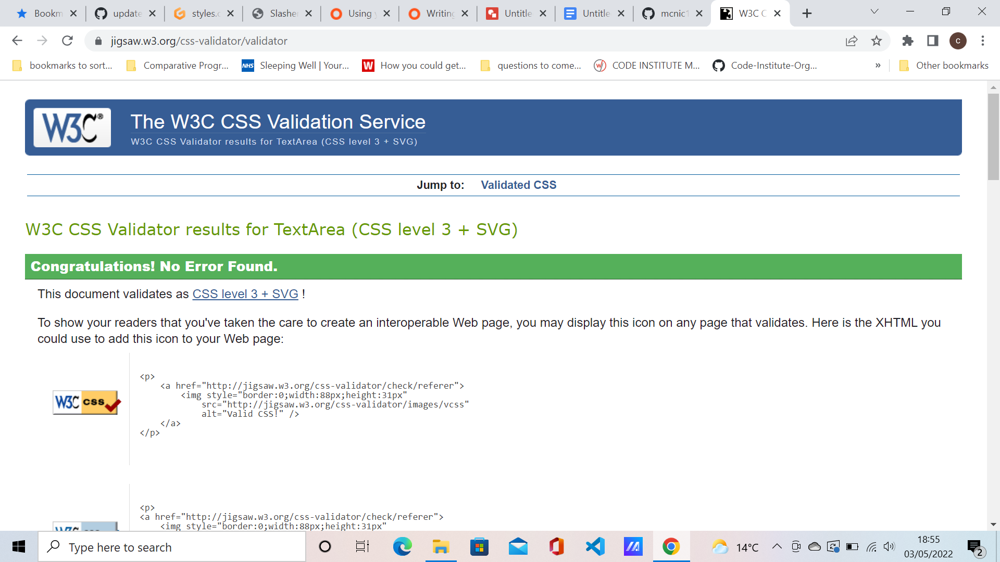

<h1 align="center">Slasher Match</h1>

[View live project](https://mcnic16.github.io/slashermatch2)

Project Goals

This game is called Slasher Match.
The goal is to match pairs of cards with horror characters on them until all matches are made.

Player Goals

Match all the cards to win the game.


<h2 align="left"></h2> 


## User Experience

1. User friendly
2. Exercises memory skills
3. Entertaining


## Design

- The main colour scheme of the game is black, red and white.

## Technologies Used

Languages:
- HTML 5 and CSS and Javascript

 ## Frameworks, Libraries & Programs Used

 Git was used for the Gitpod terminal to commit to Git and Push to GitHub.
 
 - [GitHub:](https://github.com/)
 GitHub is used to store the projects code after being pushed from Git

 ## Wireframes

 - Google Docs, Drawings was used to the wireframe


## Testing

-  [W3C Markup Validator](https://jigsaw.w3.org/css-validator/#validate_by_input) The W3C Markup Validator was used for HTML testing which it failed on :


- I deleted the match class in the paragraph, as it was not required and was causing an error.
- I continue to have a warning about an empty section but this is irrelevant as the whole game is in Javascript.


- [W3C CSS Validator](https://jigsaw.w3.org/css-validator/#validate_by_input) The W3C validator was used to validate the CSS which all passed.





- Lighthouse in Chrome Devtools was used to check for the game performance


### Further Testing

This game has been checked on various phones, tablets, a laptop and a desktop.

### Bugs

When I first coded this game, all the pictures were in HTML and there was a Slasher Match logo on
the back of the cards. Doing it this way caused trouble when getting the cards to flip, so I altered the code for the pictures to be in Javascript. This solved the issue.

I also had problems with getting CSS working in the browser when altering the CSS code. I had two previous repositories of slashermatch and slashermatch1 which all have git commits on them. In order to rectify, I completed a hard reset and emptied the cache on numerous occasions. The problems have persisted but on this repository everything is in working order.

When all matches had been completed, the very last card would not turn over. To rectify this, I added a new game button. This now gives the player the ability to restart the game when they choose and also removed the issue with the last card.

When you restarting a game, the cards would reshuffle before they flipped back over causing the player to see where all the matches were.  I added a settimeout function within the restart function to remedy this issue.


### Known Bugs
- On some touch screen mobile devices, players will need to zoom in on the game using the pinch to zoom facility. On desktops and laptops, players may need to zoom in/out on their setting or using the shortcut Ctrl and rolling the mouse middle button.

## Deployment
- The project was deployed to GitHub Pages using the following steps...
1. Log in to GitHub and locate the [GitHub Repository](https://github.com/)
2. At the top of the Repository (not top of page), locate the "Settings" Button on the menu.
    - Alternatively Click [Here](https://raw.githubusercontent.com/) for a GIF demonstrating the process starting from Step 2.
3. Scroll down the Settings page until you locate the "GitHub Pages" Section.
4. Under "Source", click the dropdown called "None" and select "Master Branch".
5. The page will automatically refresh.
6. Scroll back down through the page to locate the now published site [link](https://github.com) in the "GitHub Pages" section.

### Forking the GitHub Repository
- By forking the GitHub Repository we make a copy of the original repository on our GitHub account to view and/or make changes without affecting the original repository by using the following steps...
1. Log in to GitHub and locate the [GitHub Repository](https://github.com/)
2. At the top of the Repository (not top of page) just above the "Settings" Button on the menu, locate the "Fork" Button.
3. You should now have a copy of the original repository in your GitHub account.
### Making a Local Clone
1. Log in to GitHub and locate the [GitHub Repository](https://github.com/)
2. Under the repository name, click "Clone or download".
3. To clone the repository using HTTPS, under "Clone with HTTPS", copy the link.
4. Open Git Bash
5. Change the current working directory to the location where you want the cloned directory to be made.
6. Type `git clone`, and then paste the URL you copied in Step 3.
```
$ git clone https://github.com/YOUR-USERNAME/YOUR-REPOSITORY
```
7. Press Enter. Your local clone will be created.
```
$ git clone https://github.com/YOUR-USERNAME/YOUR-REPOSITORY
> Cloning into `CI-Clone`...
> remote: Counting objects: 10, done.
> remote: Compressing objects: 100% (8/8), done.
> remove: Total 10 (delta 1), reused 10 (delta 1)
> Unpacking objects: 100% (10/10), done.
```
Click [Here](https://help.github.com/en/github/creating-cloning-and-archiving-repositories/cloning-a-repository#cloning-a-repository-to-github-desktop) to retrieve pictures for some of the buttons and more detailed explanations of the above process.

## Credits
The illustrations in this game are down to my wife Fran McNicol.

### Acknowledgements
-   My Mentor for continuous helpful feedback.
-   Tutor support at Code Institute for their support.
-   My Wife for the illustrations.


